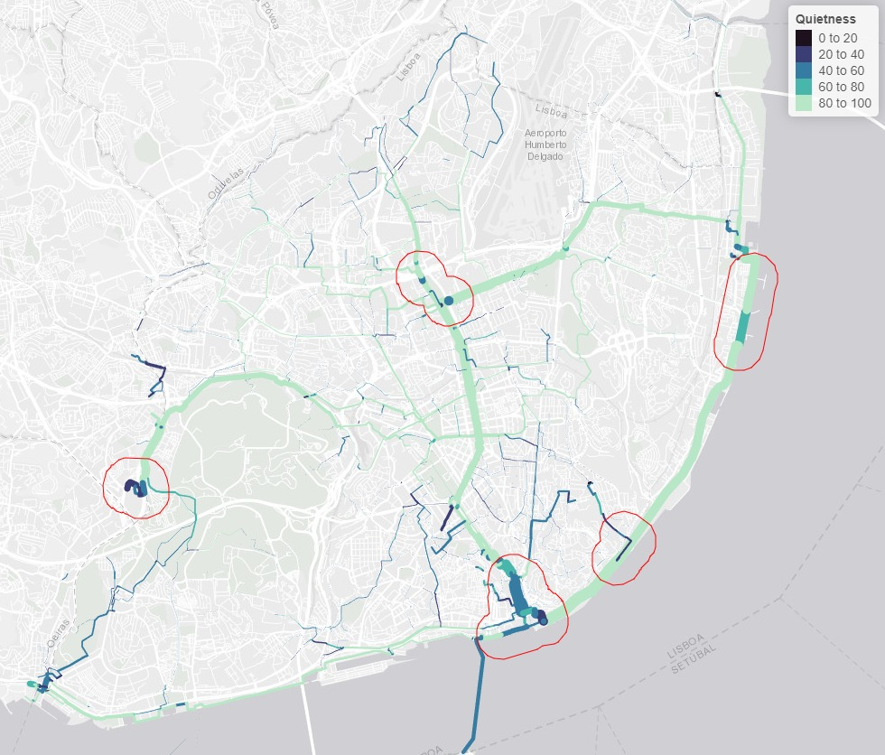

Exploring jittering and routing options for converting
origin-destination data into route networks: towards accurate estimates
of movement at the street level
================
Robin Lovelace, Rosa Félix, Dustin Carlino

<!-- README.md is generated from README.Rmd. Please edit that file -->

Note: this has been submitted to the academic track of FOSS4G. See
<https://osf.io/4yxj7/> for the preprint.

# Introduction

Origin-destination (OD) datasets provide information on aggregate travel
patterns between zones and geographic entities, and can be obtained from
a wide range of sources making them one of the most commonly used
geographic inputs in applied transport planning (Alexander et al.,
2015). OD datasets are often ‘implicitly geographic’, containing
identification codes of the geographic objects from which trips start
and end. Exact coordinates of origins and destinations are provided in
this way for good reasons: historically computational resources
constrained analysis options, meaning that data reduction (by converting
thousands of travel survey responses into a more compact aggregate OD
dataset) was important; and privacy considerations prevent the
disclosure of exact trip start and end points (Boyce and Williams,
2015).

A common approach to converting OD datasets to geographic entities, for
example represented using the simple features standard (Open Geospatial
Consortium Inc, 2011) and saved in file formats such as GeoPackage and
GeoJSON, is to represent each OD record as a straight line between zone
centroids. This approach to representing OD datasets on the map has been
since at least the 1950s (Boyce and Williams, 2015) and — despite the
development of various methods to add value to OD datasets by sampling
start and end points and ‘connectors’ withing each zone (Lovelace et
al., 2022b), discussed below — centroid-based geographic representations
of OD data are still dominant (Rae, 2009; Tennekes and Chen, 2021).
Before explaining the methods, it is worth defining terms:

-   **Origins**: locations of trip departure, typically stored as ID
    codes linking to zones

-   **Destinations**: trip destinations, also stored as ID codes linking
    to zones

-   **Attributes**: the number of trips made between each ‘OD pair’ and
    additional attributes such as route distance between each OD pair

-   **Jittering**: The combined process of ‘splitting’ OD pairs
    representing many trips into multiple ‘sub OD’ pairs
    (disaggregation) and assigning origins and destinations to multiple
    unique points within each zone

Beyond simply visualising aggregate travel patterns, centroid-based
geographic desire lines are also used as the basis of many transport
modelling processes. The following steps can be used to convert OD
datasets into route networks, in a process that can generate nationally
scalable results (Morgan and Lovelace, 2020):

-   OD data converted into centroid-based geographic desire lines

-   Calculation of routes for each desire line, with start and end
    points at zone centroids

-   Aggregation of routes into route networks, with values on each
    segment representing the total amount of travel (‘flow’) on that
    part of the network, using functions such as `overline()` in the
    open source R package `stplanr` (Lovelace and Ellison, 2018)

This approach is tried and tested: the OD

desire line

route

route network processing pipeline forms the basis of the route network
results in the Propensity to Cycle Tool, an open source and publicly
available map-based web application for informing strategic cycle
network investment, ‘visioning’ and prioritisation (Goodman et al.,
2019; Lovelace et al., 2017). However, the approach has some key
limitations:

-   Flows are concentrated on transport network segments leading to zone
    centroids, creating distortions in the results and preventing the
    simulation of the diffuse networks that are particularly important
    for walking and cycling

-   The results are highly dependent on the size and shape of geographic
    zones used to define OD data

-   The approach is inflexible, providing few options to people who want
    to use valuable OD datasets in different ways

To overcome these limitations, methods of ‘jittering’ OD data have been
developed (Lovelace et al., 2022b). While the results from analysis of
route networks generated from jittered OD data in that paper were
promising, the input datasets were small and technique was not evaluated
with reference to ground truth data. This raised the question “Are the
jittered results measurably better when compared with counter datasets
on the network?” (Lovelace et al., 2022b).

This question was partially addressed during a presentation and
subsequent proceedings published as part of the GISRUK conference
(Lovelace et al., 2022a). However, the input dataset used for that
conference paper was small and overly focussed on Edinburgh.
Furthermore, only a single routing option was used, raising the
question: what is the relative importance of geographic OD data
pre-processing (jittering) and routing options when preparing route
networks to support strategic sustainable transport plans? We set out to
address this question in this paper.

## Software and reproducibility

In this paper present results generated using the `odjitter` Rust crate.
We developed an interface to R in the `odjitter` R package (not on CRAN
at the time of writing) that can form the basis of a implementations in
other languages that interface with the highly efficient Rust
implementation. The results presented in this paper are fully
reproducible. See the paper’s GitHub repository at
<https://github.com/Robinlovelace/foss4g22/> for implementation details
and to reproduce the results.

# Approach

## Jittering

Jittering represents a comparatively simple — compared with ‘connector’
based methods (Jafari et al., 2015) — approach is to OD data
preprocessing. For each OD pair, the jittering approach consists of the
following steps for each OD pair (provided it has required inputs of a
disaggregation threshold, a single number greater than one, and
sub-points from which origin and destination points are located):

1.  Checks if the number of trips (for a given ‘disaggregation key’,
    e.g. ‘walking’) is greater than the disaggregation threshold.
2.  If so, the OD pair is disaggregated. This means being divided into
    as many pieces (‘sub-OD pairs’) as is needed, with trip counts
    divided by the number of sub-OD pairs, for the total to be below the
    disaggregation threshold.
3.  For each sub-OD pair (or each original OD pair if no disaggregation
    took place) origin and destination locations are randomly sampled
    from sub-points which optionally have weights representing relative
    probability of trips starting and ending there.

This approach has been implemented efficiently in the Rust crate
`odjitter`, the source code of which can be found at
<https://github.com/dabreegster/odjitter>.

## Case study

Lisbon, Portugal, is a city with about half million residents. By 2018,
when a mobility survey was carried on, and only about 0.5% of trips were
made by bicycle. However, the investments in cycling infrastructure,
reaching 150 km of cycling network in 2021, and the implementation of a
dock-based bike-sharing system had a major impact on cycling levels
(Félix et al., 2020).

Cyclists’ counts are performed yearly from 2017 to 2021 at more than 65
locations in Lisbon during morning and afternoon peak hours (8-10 am and
5-7 pm). In 2021, these were carried out in October. The 67 locations,
shown in Figure , were chosen considering to the existent and planned
cycling infrastructure, and places where there was no cycling
infrastructure, but had already some presence of cyclists.

<!-- \begin{figure*} -->
<!-- {\centering \includegraphics[width=0.6\linewidth]{README_files/figure-latex/lisbonmap-1}  -->
<!-- } @spatstat-->
<!-- \caption{\label{lisbonmap}Cycling infrastructure in Lisbon as October 2021 and location of cyclists' counters.}\label{fig:lisbonmap} -->
<!-- \end{figure*} -->

## Methods

We use data from a mobility survey (Instituto National de Estatística,
2018) at district level (Lisbon has 24 districts), including 4955 daily
bicycle trips, represented by 122 desire lines. Cycling count data
includes 26464 passings in the total of the 67 locations (one trip may
pass at more than one location).

Routes were computed using [*CycleStreets*](https://cyclestreets.net),
which relies on 2022 road network from OpenStreetMap, using the [`r5`
engine](https://ipeagit.github.io/r5r/) (Pereira et al., 2021), and
using *Google Maps* service, for routing comparison. Routes were
calculated using reproducible code available in the GitHub repo
associated with this paper thanks to the `stplanr`, `r5r` and
`cyclestreets` R packages that provide interfaces to these routing
engines.

Regarding the routing options, CycleStreets provides 3 options of
cycling routes: “fastest”, “balanced” and “quietest”, while r5r uses the
Level of Traffic Stress (LTS), ranging from 1 — less bicycle friendly,
to 4 — more bicycle friendly (Mekuria et al., 2012). Google Maps does
not provide such profile options for bicycle routing. In this research
we compared CycleStreets’ “quietest” and “fastest” modes, and LTS 2 and
4 (Desjardins et al., 2022; Mekuria et al., 2012).

This was an iterative process, an not all options were tested due to the
computational requirements. We started by generating routes with
CycleStreets for the 3 routing profiles and for unjittered, jittered
with no disagregation, and jittered with disagregation level of 500
trips. Then we compared the results with routes generated by r5r, for 2
levels of traffic stress (2 and 4), and with routes generated by Google.
Other jittering disagregation level of 200 trips was also compared with
the previous results, for routes generated with CycleStreets (“quietest”
profile) and for routes generated with r5r (LTS 2).

Results were then assessed. Count data was compared with the resulting
route networks (with information on bike trips at each segment level,
from the mobility survey data) by taking the value of the nearest
segment, and using a R2 correlation fit.

# Results

We generated route networks based on a range of different jittering
parameters and routing options. The results presented in this section
not only report estimates of model-counter fit but also provide
indication of the type of networks generated, though route network maps.
Figures , and show the difference between desire lines with centroids
approach and the jittering approach, for bike trips in Lisbon.

Figures , , and show examples of route networks from unjittered OD
pairs, and jittered OD pairs with disagregation level of 500 trips, for
differen routing providers, and the counters location.

When comparing the route network with unjittered desire lines (Figure )
with the jittered ones (Figures , and ), we may find that the route
networks from jittered desire lines are more diffuse, and not
concentrated in a few routes. For cycling and walking, this bring more
realistic routes for this transport modes. Nevertheless, we are aware
that routing options “quiet”, and LTS 2 (quieter than LTS4), have a
higher weight in using the existing cycling network infrastructure, and
then the resulting route network can be similar to the cycling network
silhouette (see Figure ). In fact, cyclists tend to opt for a cycling
infrastructure when it is available, even if it compromises the
directness of their trips (Broach et al., 2012). It is also noticed that
“Fastest” and LTS4 routing option does not have a good fit with the
counting data, when compared with the “Quietest” and LTS2.

Regarding the different disagregation levels, a route network build from
a jittering disagregation of 200 trips is shown in Figure , with a more
diffuse network.

Although useful for visualizing the complex and spatially diffuse
reality of travel patterns, we found that the most valuable use of
jittering is as a pre-processing stage before routing and route network
generation. Route networks generated from jittered desire lines are more
diffuse, and potentially more realistic, than centroid-based desire
lines.

We also found that the approach, implemented in Rust and with bindings
to R and Python (in progress), is fast. Benchmarks show that the
approach can ‘jitter’ desire lines representing millions of trips in a
major city in less than a minute on consumer hardware.

We also found that the results of jittering depend on the geographic
input datasets representing start points and trip attractors, and the
use of weights.

Table shows the counter data vs modeled route network fit, with
different routing and jittering parameters. We can observe that jittered
OD pairs provide a better fit result, with disagregation.

| Jittering                    | Routing  | Nrow | R-Squared |
|:-----------------------------|:---------|-----:|----------:|
| Unjittered                   | quietest |  122 |      0.23 |
| Unjittered                   | balanced |  122 |      0.22 |
| Unjittered                   | fastest  |  122 |      0.10 |
| Unjittered                   | LTS2     |  122 |      0.35 |
| Unjittered                   | LTS4     |  122 |      0.04 |
| Jittered, no disaggregation  | quietest |  122 |      0.26 |
| Jittered, no disaggregation  | balanced |  122 |      0.11 |
| Jittered, no disaggregation  | fastest  |  122 |      0.00 |
| Jittered, 500 disaggregation | quietest |  799 |      0.50 |
| Jittered, 500 disaggregation | balanced |  799 |      0.42 |
| Jittered, 500 disaggregation | fastest  |  799 |      0.08 |
| Jittered, 500 disaggregation | LTS2     |  799 |      0.54 |
| Jittered, 500 disaggregation | LTS4     |  799 |      0.14 |
| Jittered, 500 disaggregation | Google   |  799 |      0.25 |
| Jittered, 200 disaggregation | quietest | 1895 |      0.54 |
| Jittered, 200 disaggregation | LTS2     | 1895 |      0.54 |

Results showing counter/model fit for route networks generated from
different routing and jittering parameters

A higher jittered disagregation level (200 trips) does not bring a
better fit against a lower disagregation level of 500 trips. This might
be explained but the routing profile used in the routing engines, and
the location of the cycling counters — most of them at the existing
cycling infrastructure. Although a more diffuse route network is
expected in active transportation modes, the available data and computed
routes are usually closer to where cycling infrastructure exists. Other
data should be used to validate this hypothesis, such as a more diffuse
cyclists’ counters location, or/and the actual cyclist’s routes — for
example, bike sharing trips routes, despite their access is not usually
guaranteed for research purposed.

The results from our analysis suggest that investment in cycle
infrastructure is particularly important in a few key locations where
cycling potential is high yet provision is poor. These locations are
highlighted in Figure @ref(fig:segments), which was generated using
information from three key sources:

-   Estimates of cycling potential, generated using the jittering
    
    routing
    
    route network methods presented in this paper.
-   Estimates of quietness of links on the network, computed with the
    open source cyclestreets R package (Desjardins et al., 2022).
-   Local knowledge, which was used to visually inspect the resulting
    networks and identify key ‘severance’ points in the network (Mindell
    and Anciaes, 2020).

<!-- \begin{figure} -->
<!--   \includegraphics[width=\textwidth]{figures/priority-segments} -->
<!--   \caption{Segments on the transport network of Lisbon where investment in new cycling infrastructure should be prioritised according to the route networks generated using methods presented in this paper, alongside local knowledge.} -->
<!--   \label{fig:segments} -->
<!-- \end{figure} -->

Figure @ref(fig:segments) highlights the policy relevant nature of this
research. A key finding is that, combined with local knowledge and
detailed data on existing transport infrastructure, which can be used to
generate metrics such as Level of Traffic Stress (LTS) (Wang et al.,
2016) and Cycling Level of Service (CLoS) (Deegan, 2015), route networks
generated from jittered, disaggregated, and appropriated routed OD data
can help prioritise investment where it is most needed. Results were
presented to stakeholders working in the local area who said that these
new results would support their investment plans.

The overall result was the finding that OD jittering methods first
developed by Lovelace et al. (2022b) are not enough on their own to
generate accurate route networks. Jittering leads to more spatially
diffuse route networks than networks generated from the common approach
of routing from and to zone centroids. However, the results presented in
this section show that careful consideration of routing options is
needed in addition to evidence-based selection of jittering parameters.

# Conclusion

Building on previous work (Lovelace et al., 2022b), we have explored the
relative importance of jittering and routing options for generating
accurate route network level estimates of movement, down to the street
level. In corroboration with previous research, we found that jittering
leads to more spatially diverse geographic representations of travel
between zones and estimates of flow down to the link level (Lovelace et
al., 2022a). A new finding was that jittering alone cannot be guaranteed
to generate accurate route network levels results: appropriate routing
options should be tested and identified.

The results were generated only for a single city and we did not explore
the full parameter space (alternative subpoint weighting parameters in
the jittering process are discussed below). For these reasons, we cannot
draw specific and universally applicable conclusions about the optimal
settings for accurate route network generation in other cities: t should
be remembered that route networks and cycling preferences vary from city
to city (Buehler and Dill, 2016). However, although our findings were
based on a single case study, Lisbon, Portugal, the findings have
implications for future work using OD data to support evidence-based
investment in sustainable transport infrastructure (e.g. Vybornova et
al., 2022). The main conclusion is that both careful translation of OD
data to geographic start and end locations and disaggregation and
careful selection of routing options are needed *in combination* to
ensure that route networks derived from OD data are diffuse and
accurate.

Accurate route network representations of transport systems are needed
to support investment in a variety of transport interventions (Morgan
and Lovelace, 2020). We have focused in this study on cycleway network
because a complete cycle network represents one of the most
cost-effective ways to reduce car dependence and associated
environmental, economic, social and health costs (Wałdykowski et al.,
2022). Cycleway *networks*, rather than simply isolated routes or other
geographically sparse interventions, are vital for successful active
travel investment (Buehler and Dill, 2016). Our results are therefore
highly policy relevant, adding value to established methods of adding
value to OD data to support sustainable transport planning (Larsen et
al., 2013; Lovelace et al., 2017; Mohammed and Oke, 2022).

The research presented in this paper is not without limitations. We did
not explore the full range of jittering and routing options available
due to time and computational resource constraints. Specifically,
varying the type and weights of origin and destination subpoints, as
advocated in Lovelace et al. (2022b), could lead to improved fit. This
would require filtering the subpoints used to include only certain types
of nodes on the road network (all vertices on the road network were used
as the basis for both origin subpoints and destination subpoints in this
study, see [documentation](https://github.com/dabreegster/odjitter) in
the `odjitter` Rust crate for details). Future work could explore the
use of including only residential roads, or increasing the weight
associated with residential roads, in the origin subpoints, for example.
Likewise, destination subpoints and associated weights could be altered
to prioritise key trip attractors such as schools and commercial
centres. Another limitation is the simplistic measure of accuracy used
in this study. Accuracy was inferred from goodness-of-fit between
aggregated flow values at 67 counter locations and modeled flow on
nearest segment on the network. Future work could use alternative
measures of fit such as root-mean-square error (RMSE) and more
sophisticated ways of comparing observed counter values to modeled
networked values, e.g. using inverse distance weighted measures
associated with links in close proximity to each counter, with
empirically derived bandwidths.

More broadly, the quality of the underlying route network data is
imperfect. Efforts to improve the underlying OpenStreetMap data will
continue to overcome this limitation, not just in Lisbon but worldwide
(Barrington-Leigh and Millard-Ball, 2017). This will improve the results
over time because all routing engines used in this study, except for
Google’s routing service, use OSM data. Furthermore, alternative data
sources and methods could be used to generate more accurate road
networks (e.g. Leninisha and Vani, 2015). Future work should seek to
test a wider range of jittering parameters in multiple case study areas
with larger ground truth datasets. Other fit measures, such as GEH or
SQV statistics, may also be used to compare count data with simulated
traffic volumes.

Despite these limitations, and the need for future academic work, the
results are already useful. Imperfect data-driven evidence is better
than no systematic evidence, especially when practitioners are aware of
the mechanisms underlying route network level estimates of travel
behavior such as those presented in this paper. A benefit of the
approach is that it based on open source software and reproducible code,
allowing others to build on the methods (Lovelace et al., 2020). Indeed,
a next step building on directly on the research presented in this paper
is to use the results to support strategic cycle network planning in
Lisbon and the wider area. In parallel to efforts to improve route
network representations of transport systems we therefore advocate for
the use of the approach presented in this paper, and related methods
(e.g. Cooper, 2018; Vybornova et al., 2022), to be implemented in
support of more evidence-based investment in sustainable transport
infrastructure at city, regional and national scales worldwide.

We thank Lisbon Municipal Government and Transport Infrastructure
Ireland for funding this research.

# References

Alexander, L., Jiang, S., Murga, M., Gonz, M.C., 2015. Validation of
origin-destination trips by purpose and time of day inferred from mobile
phone data. Transportation Research Part B: Methodological 1–20.
<https://doi.org/10.1016/j.trc.2015.02.018>

Barrington-Leigh, C., Millard-Ball, A., 2017. The world’s user-generated
road map is more than 80% complete. PLOS ONE 12, e0180698.
<https://doi.org/10.1371/journal.pone.0180698>

Boyce, D.E., Williams, H.C.W.L., 2015. Forecasting Urban Travel: Past,
Present and Future. Edward Elgar Publishing.

Broach, J., Dill, J., Gliebe, J., 2012. Where do cyclists ride? A route
choice model developed with revealed preference GPS data. Transportation
Research Part A: Policy and Practice 46, 1730–1740.
<https://doi.org/10.1016/j.tra.2012.07.005>

Buehler, R., Dill, J., 2016. Bikeway Networks: A Review of Effects on
Cycling. Transport Reviews 36, 9–27.
<https://doi.org/10.1080/01441647.2015.1069908>

Cooper, C.H.V., 2018. Predictive spatial network analysis for
high-resolution transport modeling, applied to cyclist flows, mode
choice, and targeting investment. International Journal of Sustainable
Transportation 0, 1–11. <https://doi.org/10.1080/15568318.2018.1432730>

Deegan, B., 2015. Cycling infrastructure in London. Proceedings of the
Institution of Civil Engineers - Engineering Sustainability 169, 92–100.
<https://doi.org/10.1680/jensu.15.00001>

Desjardins, E., Higgins, C.D., Scott, D.M., Apatu, E., Páez, A., 2022.
Correlates of bicycling trip flows in Hamilton, Ontario: Fastest,
quietest, or balanced routes? Transportation 49, 867–895.
<https://doi.org/10.1007/s11116-021-10197-1>

Félix, R., Cambra, P., Moura, F., 2020. Build it and give ‘em bikes, and
they will come: The effects of cycling infrastructure and bike-sharing
system in Lisbon. Case Studies on Transport Policy 8, 672–682.
<https://doi.org/10.1016/j.cstp.2020.03.002>

Goodman, A., Rojas, I.F., Woodcock, J., Aldred, R., Berkoff, N., Morgan,
M., Abbas, A., Lovelace, R., 2019. Scenarios of cycling to school in
England, and associated health and carbon impacts: Application of the
“Propensity to Cycle Tool.” Journal of Transport & Health 12, 263–278.
<https://doi.org/10.1016/j.jth.2019.01.008>

Instituto National de Estatística, 2018. [Mobilidade e funcionalidade do
território nas Áreas Metropolitanas do Porto e de Lisboa:
2017](https://www.ine.pt/xportal/xmain?xpid=INE&xpgid=ine_publicacoes&PUBLICACOESpub_boui=349495406&PUBLICACOESmodo=2&xlang=pt).

Jafari, E., Gemar, M.D., Juri, N.R., Duthie, J., 2015. Investigation of
Centroid Connector Placement for Advanced Traffic Assignment Models with
Added Network Detail. Transportation Research Record: Journal of the
Transportation Research Board 2498, 19–26.
<https://doi.org/10.3141/2498-03>

Larsen, J., Patterson, Z., El-Geneidy, A., 2013. [Build it. But where?
The use of geographic information systems in identifying locations for
new cycling
infrastructure](http://www.tandfonline.com/doi/abs/10.1080/15568318.2011.631098).
International Journal of Sustainable Transportation 7, 299–317.

Leninisha, S., Vani, K., 2015. Water flow based geometric active
deformable model for road network. ISPRS Journal of Photogrammetry and
Remote Sensing 102, 140–147.
<https://doi.org/10.1016/j.isprsjprs.2015.01.013>

Lovelace, R., Ellison, R., 2018. Stplanr: A Package for Transport
Planning. The R Journal 10, 7–23. <https://doi.org/10.32614/RJ-2018-053>

Lovelace, R., Félix, R., Carlin, D., Beecham, R., 2022a. Assessing
methods for generating route networks from origin-destionation data:
Jittering, routing, and visualisation.
<https://doi.org/10.5281/zenodo.6410196>

Lovelace, R., Félix, R., Carlino, D., 2022b. Jittering: A
Computationally Efficient Method for Generating Realistic Route Networks
from Origin-Destination Data. Findings 33873.
<https://doi.org/10.32866/001c.33873>

Lovelace, R., Goodman, A., Aldred, R., Berkoff, N., Abbas, A., Woodcock,
J., 2017. The Propensity to Cycle Tool: An open source online system for
sustainable transport planning. Journal of Transport and Land Use 10.
<https://doi.org/10.5198/jtlu.2016.862>

Lovelace, R., Parkin, J., Cohen, T., 2020. Open access transport models:
A leverage point in sustainable transport planning. Transport Policy 97,
47–54. <https://doi.org/10.1016/j.tranpol.2020.06.015>

Mekuria, M.C., Furth, P.G., Nixon, H., 2012. [Low-stress bicycling and
network
connectivity](https://scholarworks.sjsu.edu/cgi/viewcontent.cgi?article=1073&context=mti_publications).

Mindell, J.S., Anciaes, P.R., 2020. Chapter seven - Transport and
community severance, in: Nieuwenhuijsen, M.J., Khreis, H. (Eds.),
Advances in Transportation and Health. Elsevier, pp. 175–196.
<https://doi.org/10.1016/B978-0-12-819136-1.00007-3>

Mohammed, M., Oke, J., 2022. Origin-destination inference in public
transportation systems: A comprehensive review. International Journal of
Transportation Science and Technology.
<https://doi.org/10.1016/j.ijtst.2022.03.002>

Morgan, M., Lovelace, R., 2020. Travel flow aggregation: Nationally
scalable methods for interactive and online visualisation of transport
behaviour at the road network level. Environment & Planning B: Planning
& Design. <https://doi.org/10.1177/2399808320942779>

Open Geospatial Consortium Inc, (OGC), 2011. [OpenGIS Implementation
Specification for Geographic information - Simple feature access - Part
1: Common architecture](https://www.ogc.org/standards/sfa) (No. OGC
06-103r4). (OGC) Open Geospatial Consortium Inc.

Pereira, R.H.M., Saraiva, M., Herszenhut, D., Braga, C.K.V., Conway,
M.W., 2021. R5r: Rapid Realistic Routing on Multimodal Transport
Networks with R5 in R. Findings 21262.
<https://doi.org/10.32866/001c.21262>

Rae, A., 2009. From spatial interaction data to spatial interaction
information? Geovisualisation and spatial structures of migration from
the 2001 UK census. Computers, Environment and Urban Systems 33,
161–178. <https://doi.org/10.1016/j.compenvurbsys.2009.01.007>

Tennekes, M., Chen, M., 2021. Design Space of Origin-Destination Data
Visualization. Computer Graphics Forum 40, 323–334.
<https://doi.org/10.1111/cgf.14310>

Vybornova, A., Cunha, T., Gühnemann, A., Szell, M., 2022. Automated
Detection of Missing Links in Bicycle Networks. Geographical Analysis
n/a. <https://doi.org/10.1111/gean.12324>

Wałdykowski, P., Adamczyk, J., Dorotkiewicz, M., 2022. Sustainable Urban
Transport—Why a Fast Investment in a Complete Cycling Network Is Most
Profitable for a City. Sustainability 14, 119.
<https://doi.org/10.3390/su14010119>

Wang, H., Palm, M., Chen, C., Vogt, R., Wang, Y., 2016. Does bicycle
network level of traffic stress (LTS) explain bicycle travel behavior?
Mixed results from an Oregon case study. Journal of transport geography
57, 8–18.

