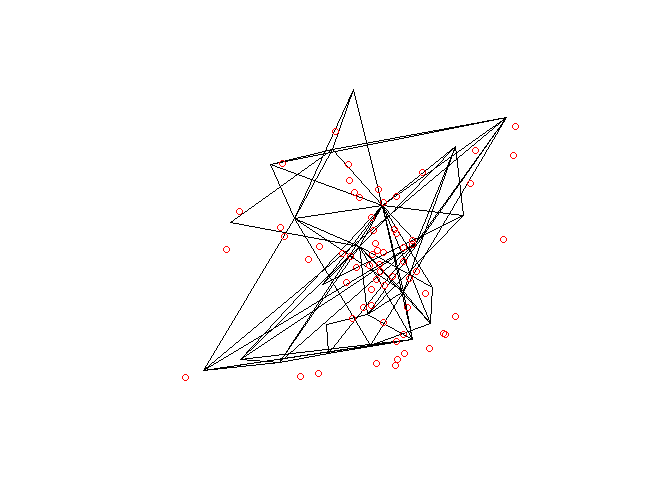

Jittering: a flexible approach for converting OD data into geographic
desire lines, routes and route networks for transport planning
================
Robin Lovelace, Rosa Félix, Dustin Carlino

<!-- README.md is generated from README.Rmd. Please edit that file -->

# Introduction

Origin-destination (OD) datasets provide information on aggregate travel
patterns between zones and geographic entities. OD datasets are
‘implicitly geographic’, containing identification codes of the
geographic objects from which trips start and end. A common approach to
converting OD datasets to geographic entities, for example represented
using the simple features standard (Open Geospatial Consortium Inc 2011)
and saved in file formats such as GeoPackage and GeoJSON, is to
represent each OD record as a straight line between zone centroids. This
approach to representing OD datasets on the map has been since at least
the 1950s (Boyce and Williams 2015) and is still in use today (e.g. Rae
2009).

Beyond simply visualising aggregate travel patterns, centroid-based
geographic desire lines are also used as the basis of many transport
modelling processes. The following steps can be used to convert OD
datasets into route networks, in a process that can generate nationally
scalable results (Morgan and Lovelace 2020):

-   OD data converted into centroid-based geographic desire lines

-   Calculation of routes for each desire line, with start and end
    points at zone centroids

-   Aggregation of routes into route networks, with values on each
    segment representing the total amount of travel (‘flow’) on that
    part of the network, using functions such as `overline()` in the
    open source R package `stplanr` (Lovelace and Ellison 2018)

This approach is tried and tested. The OD -\> desire line -\> route -\>
route network processing pipeline forms the basis of the route network
results in the Propensity to Cycle Tool, an open source and publicly
available map-based web application for informing strategic cycle
network investment, ‘visioning’ and prioritisation (Lovelace et al.
2017; Goodman et al. 2019). However, the approach has some key
limitations:

-   Flows are concentrated on transport network segments leading to zone
    centroids, creating distortions in the results and preventing the
    simulation of the diffuse networks that are particularly important
    for walking and cycling

-   The results are highly dependent on the size and shape of geographic
    zones used to define OD data

-   The approach is inflexible, providing few options to people who want
    to use valuable OD datasets in different ways

To overcome these limitations we developed a ‘jittering’ approach to
conversion of OD datasets to desire lines that randomly samples points
within each zone (Lovelace, Félix, and Carlino 2022). While that paper
discussed the conceptual development of the approach, it omitted key
details on its implementation in open source software.

In this paper we outline the implementation of jittering and demonstrate
how a single Rust crate can provide the basis of implementations in
other languages. Furthermore, we demonstrate how jittering can be used
to create more diffuse and accurate estimates of movement at the level
of segments (‘flows’) on transport network, in reproducible code-driven
workflows and with minimal computational overheads compared with the
computationally intensive process of route calculation (‘routing’) or
processing large GPS datasets. The overall aim is to describe the
jittering approach in technical terms and its implementation in open
source software.

Before describing the approach, some definitions are in order:

-   **Origins**: locations of trip departure, typically stored as ID
    codes linking to zones

-   **Destinations**: trip destinations, also stored as ID codes linking
    to zones

-   **Attributes**: the number of trips made between each ‘OD pair’ and
    additional attributes such as route distance between each OD pair

-   **Jittering**: The combined process of ‘splitting’ OD pairs
    representing many trips into multiple ‘sub OD’ pairs
    (disaggregation) and assigning origins and destinations to multiple
    unique points within each zone

# Approach

Jittering represents a comparatively simple — compared with ‘connector’
based methods (Jafari et al. 2015) — approach is to OD data
preprocessing. For each OD pair, the jittering approach consists of the
following steps for each OD pair (provided it has required inputs of a
disaggregation threshold, a single number greater than one, and
sub-points from which origin and destination points are located):

1.  Checks if the number of trips (for a given ‘disaggregation key’,
    e.g. ‘walking’) is greater than the disaggregation threshold.
2.  If so, the OD pair is disaggregated. This means being divided into
    as many pieces (‘sub-OD pairs’) as is needed, with trip counts
    divided by the number of sub-OD pairs, for the total to be below the
    disaggregation threshold.
3.  For each sub-OD pair (or each original OD pair if no disaggregation
    took place) origin and destination locations are randomly sampled
    from sub-points which optionally have weights representing relative
    probability of trips starting and ending there.

This approach has been implemented efficiently in the Rust crate
`odjitter`, the source code of which can be found at
<https://github.com/dabreegster/odjitter>.

## Case study

Lisbon, Portugal, is a city with about half million residents. By 2018,
when a mobility survey was carried on, and only about 0.5% of trips were
made by bicycle. However, the investments in cycling infrastructure,
reaching 150 km of cycling network in 2021, and the implementation of a
dock-based bike-sharing system had a major impact on cycling levels
(Félix, Cambra, and Moura 2020)

Cyclists’ counts are performed yearly from 2017 to 2021 at 45 locations
in Lisbon during morning and afternoon peak hours (8-10 am and 5-7 pm).
In 2021, these were carried out in October. The 67 locations, shown in
Figure 1, are chosen considering to the existent and planned cycling
infrastructure, and places where there was no cycling infrastructure,
but had already some presence of cyclists.

We use data from this mobility survey (Instituto National de Estatística
2018) at district level (Lisbon has 24 districts) to compare with the …
Routes are computed using *Cyclestreets*, which relies on 2022 road
network from OpenStreetMap.

# Results

Jittering leads to more spatially diffuse representations of OD datasets
than the common approach to desire lines that go from and to zone
centroids. We have used the approach to add value to numerous OD
datasets for projects based in Ireland, Norway, Portugal, New Zealand
and beyond.

In this particular case, Biclar project… validadion of the used method.

Figure @ref(fig:lisbon1) shows the difference between desire lines with
centroids approach and the jittering approach.

Figure @ref(fig:map1) shows and example of route network from unjittered
OD pairs, and jittered OD pairs with disagregation level of 500 trips,
for routing option “quietest”, and the counters.

Although useful for visualising the complex and spatially diffuse
reality of travel patterns, we found that the most valuable use of
jittering is as a pre-processing stage before routing and route network
generation. Route networks generated from jittered desire lines are more
diffuse, and potentially more realistic, than centroid-based desire
lines.

We also found that the approach, implemented in Rust and with bindings
to R and Python (in progress), is fast. Benchmarks show that the
approach can ‘jitter’ desire lines representing millions of trips in a
major city in less than a minute on consumer hardware.

We also found that the results of jittering depend on the geographic
input datasets representing start points and trip attractors, and the
use of weights.

Table 1 shows the counter data vs modeled route network fit, with
different routing and jittering parameters. We can observe that jittered
OD pairs provide a better fit result, with disagregation. It is also
noticed that “Balanced” routing option has

| Jittering                    | Routing  | Nrow | R-Squared |
|:-----------------------------|:---------|-----:|----------:|
| Unjittered                   | quietest |  122 |      0.23 |
| Unjittered                   | balanced |  122 |      0.22 |
| Unjittered                   | fastest  |  122 |      0.10 |
| Unjittered                   | LTS2     |  122 |      0.35 |
| Unjittered                   | LTS4     |  122 |      0.04 |
| Jittered, no disaggregation  | quietest |  122 |      0.26 |
| Jittered, no disaggregation  | balanced |  122 |      0.11 |
| Jittered, no disaggregation  | fastest  |  122 |      0.00 |
| Jittered, 500 disaggregation | quietest |  799 |      0.50 |
| Jittered, 500 disaggregation | balanced |  799 |      0.42 |
| Jittered, 500 disaggregation | fastest  |  799 |      0.08 |
| Jittered, 500 disaggregation | LTS2     |  799 |      0.54 |
| Jittered, 500 disaggregation | LTS4     |  799 |      0.14 |
| Jittered, 500 disaggregation | Google   |  799 |      0.25 |

Results showing counter/model fit for route networks generated from
different routing and jittering parameters

# Conclusion

Building on previous work , we have explored the relative importance of
parameters that ‘jitter’ and disaggregate OD data to create more
spatially diverse geographic representations of travel between zone
*and* the routing settings used. We found that the combination of
careful selection of routing profiles, in addition to careful and
iteratively selected jittering parameters is needed for realistic route
network results, based on a case study of Lisbon, Portugal. We cannot
draw conclusions about the optimal settings for accurate route network
generation in other cities because each route network and set of cycling
preferences is different. Future work should seek to test a wider range
of jittering parameters in multiple case study areas with larger ground
truth datasets.

# References

Boyce, David E., and Huw C. W. L. Williams. 2015. *Forecasting Urban
Travel: Past, Present and Future*. Edward Elgar Publishing.

Félix, R., P. Cambra, and F. Moura. 2020. “Build It and Give ‘Em Bikes,
and They Will Come: The Effects of Cycling Infrastructure and
Bike-Sharing System in Lisbon.” *Case Studies on Transport Policy*.
<https://doi.org/10.1016/j.cstp.2020.03.002>.

Goodman, Anna, Ilan Fridman Rojas, James Woodcock, Rachel Aldred,
Nikolai Berkoff, Malcolm Morgan, Ali Abbas, and Robin Lovelace. 2019.
“Scenarios of Cycling to School in England, and Associated Health and
Carbon Impacts: Application of the ‘Propensity to Cycle Tool’.” *Journal
of Transport & Health* 12 (March): 263–78.
<https://doi.org/10.1016/j.jth.2019.01.008>.

Instituto National de Estatística. 2018. “Mobilidade e Funcionalidade Do
Território Nas Áreas Metropolitanas Do Porto e de Lisboa: 2017.” Lisboa.
<https://www.ine.pt/xportal/xmain?xpid=INE&xpgid=ine_publicacoes&PUBLICACOESpub_boui=349495406&PUBLICACOESmodo=2&xlang=pt>.

Jafari, Ehsan, Mason D. Gemar, Natalia Ruiz Juri, and Jennifer Duthie.
2015. “Investigation of Centroid Connector Placement for Advanced
Traffic Assignment Models with Added Network Detail.” *Transportation
Research Record: Journal of the Transportation Research Board* 2498
(June): 19–26. <https://doi.org/10.3141/2498-03>.

Lovelace, Robin, and Richard Ellison. 2018. “Stplanr: A Package for
Transport Planning.” *The R Journal* 10 (2): 7–23.
<https://doi.org/10.32614/RJ-2018-053>.

Lovelace, Robin, Rosa Félix, and Dustin Carlino. 2022. “Jittering: A
Computationally Efficient Method for Generating Realistic Route Networks
from Origin-Destination Data.” *Findings*, April.
<https://doi.org/10.32866/001c.33873>.

Lovelace, Robin, Anna Goodman, Rachel Aldred, Nikolai Berkoff, Ali
Abbas, and James Woodcock. 2017. “The Propensity to Cycle Tool: An Open
Source Online System for Sustainable Transport Planning.” *Journal of
Transport and Land Use* 10 (1). <https://doi.org/10.5198/jtlu.2016.862>.

Morgan, Malcolm, and Robin Lovelace. 2020. “Travel Flow Aggregation:
Nationally Scalable Methods for Interactive and Online Visualisation of
Transport Behaviour at the Road Network Level.” *Environment & Planning
B: Planning & Design*, July. <https://doi.org/10.1177/2399808320942779>.

Open Geospatial Consortium Inc, (OGC). 2011. “OpenGIS Implementation
Specification for Geographic Information - Simple Feature Access - Part
1: Common Architecture.” OGC 06-103r4. (OGC) Open Geospatial Consortium
Inc. <https://www.ogc.org/standards/sfa>.

Rae, Alasdair. 2009. “From Spatial Interaction Data to Spatial
Interaction Information? Geovisualisation and Spatial Structures of
Migration from the 2001 UK Census.” *Computers, Environment and Urban
Systems* 33 (3): 161–78.
<https://doi.org/10.1016/j.compenvurbsys.2009.01.007>.

